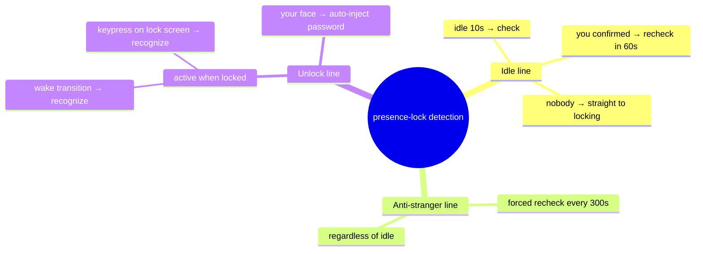
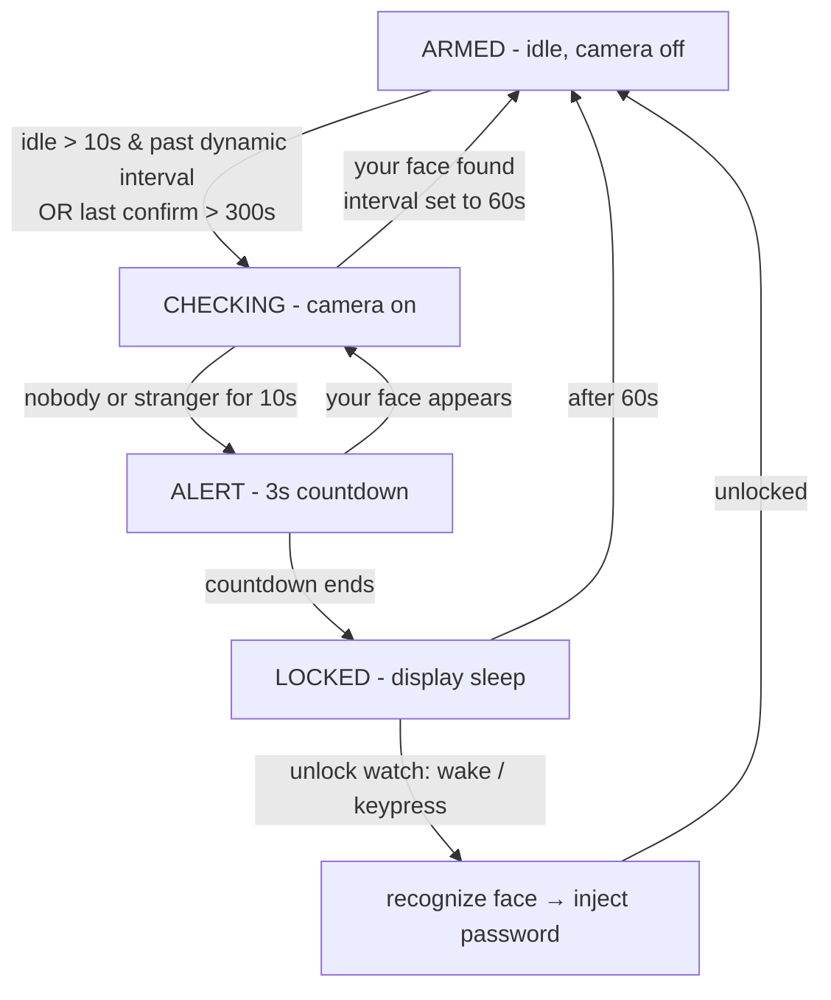

# PresenceLock

[](LICENSE)
[](https://www.python.org/)
[](https://www.apple.com/macos/)

[🇨🇳 中文](README.zh.md) | [🇬🇧 English](README.md)

> Auto-lock your Mac when the person at the keyboard is **not you**.
> Webcam presence detection with face identity verification, running 100% locally.

---

## Why (Motivation)

I kept forgetting to lock my Mac when leaving my desk — in an office, a lab, a shared space, that's a privacy risk. The obvious fix is "lock when I walk away", but every existing option on macOS disappointed me:

- **Bluetooth proximity apps** (the entire App Store category): they judge presence by phone distance — slow to react, unreliable, and useless the moment you leave your phone on the desk.
- **No camera-based option exists on macOS at all** (see the gap below).

I wanted a tool that answers the real question: *is the person at this keyboard me?* — not "is a phone nearby?". That's what this is.

## The Gap: nobody builds this for macOS

| Platform | Camera-based walk-away lock | Notes |
|---|---|---|
| Windows | ✅ Microsoft Dynamic Lock (Bluetooth) + open-source tools (e.g. SeatSentinel, windows_bey) | Dynamic Lock is Bluetooth, not camera; several camera tools exist |
| Linux | ✅ boltgolt/howdy (7.7k★) and others | howdy is face *unlock*; walk-away locking is bolted on by users |
| **macOS** | ❌ **Nothing.** App Store = Bluetooth-only. GitHub = zero camera-based presence-lock projects. | |

Why the gap? Three macOS-specific walls that this project walks through:

1. **TCC privacy permissions** — reading the camera from a CLI process fails silently unless you request permission the right way (see the bundled `grant_camera.swift`).
2. **No public lock-screen API** — every naive approach (osascript key events, CGEvent injection, CGSession) fails on modern macOS. This project uses `pmset displaysleepnow` — zero-permission, works everywhere.
3. **The camera indicator light** — always-on cameras are creepy and wasteful, so this project opens the camera **only when it needs to check**.

## How it differs from existing solutions

| | **PresenceLock** (macOS) | Bluetooth proximity apps | Other platform camera tools |
|---|---|---|---|
| Verifies **your identity**, not just "a person exists" | ✅ | ❌ phone proximity only | mostly ❌ (only some do face match) |
| Lock latency | seconds | tens of seconds / unreliable | seconds |
| Camera always on | ❌ opens on demand (~2s every 30s idle, or every 5 min while active) | — | often always-on |
| Zero-permission locking (no Accessibility/Auxiliary access) | ✅ `pmset displaysleepnow` | — | varies |
| 100% local processing (Vision Neural Engine, nothing uploaded) | ✅ | — | varies |
| Stranger-resistant | ✅ keyboard/mouse activity does NOT disarm the check; periodic re-verification every 5 min | ❌ | varies |

## Features

- **Face identity, not face detection** — registers your face once, then requires *your* face to consider the desk occupied. Strangers, roommates, and empty chairs all trigger the lock.
- **Stranger-resistant state machine** — typing/moving the mouse never clears the alarm; only seeing your face does. Periodic re-verification (default 5 min) catches someone who sits down after you leave.
- **Camera on demand** — the green light is off almost all the time. The camera opens only when the keyboard/mouse has been idle past a threshold, then closes again.
- **Lock-screen countdown** — a 3-second notification before locking; look at the camera to cancel (prevents false locks from bending down to pick up a pen).
- **Zero-permission locking** — `pmset displaysleepnow` + system "require password after display sleep". No Accessibility, no key injection, no private APIs.
- **Wake auto-unlock** (optional, config `unlock_enabled`) — after any key wakes the screen (or a keypress on the lock screen), the camera recognizes *your* face and the password (stored in Keychain) is injected into the login window — no Touch ID needed. Camera opens only for a few seconds during detection. Built for external-display / no-Touch-ID setups (Mac mini, closed-lid MacBook), where Apple's own answer is an Apple Watch (extra hardware) and this needs zero added hardware.
- **Double-click launcher** — `start-presence-lock.command` runs it in the background (closing the terminal window does not stop it, and it probes the auto-unlock permission at start); `stop-presence-lock.command` stops it.

## Installation

Requires macOS 14+ and Xcode Command Line Tools (only to compile the tiny permission helper).

```bash
git clone https://github.com/zhonxia/presence-lock.git
cd presence-lock
python3 -m venv .venv
.venv/bin/pip install -r requirements.txt
```

## Quick Start

```bash
# 1. Grant camera permission (compiled helper pops the system dialog once)
swiftc -O grant_camera.swift -o grant_camera_bin && ./grant_camera_bin

# 2. Register your face (s = capture, 3 shots at slightly different angles, q = save)
./run.sh register.py

# 3. Dry-run first: detect without locking (optional --preview shows the camera view)
./run.sh main.py --dry-run --preview

# 4. Run for real
./run.sh main.py
```

Make sure the system is set to require a password after display sleep:
**System Settings > Lock Screen > Require password after screen saver begins or display is turned off > Immediately**.

### Auto-unlock (optional) setup

Password injection needs the **host app granted Accessibility** (System Settings > Privacy & Security > Accessibility). Authorize iTerm if you launch from it, or authorize "Terminal" for double-click launch — the start script probes this and prints the status.

Store your login password in the Keychain once (re-run it after changing your password):

```bash
security add-generic-password -a presence-lock -s presence-lock-unlock -w 'your Mac password'
```

Set `unlock_enabled` to `false` in config.json to disable auto-unlock.

## Architecture

Four-state machine + three independent detection lines. The one rule that matters: **only your face, seen by the camera, ever disarms the lock.** Idle time only decides *when* to look.





Face embedding: Apple Vision `VNCreateFaceprintRequest` (128-dim, Neural Engine). Configurable parameters in `config.json` (idle/absent/countdown thresholds, match distance, recheck interval).

## File Structure

```
presence-lock/
├── main.py                    # state machine + main loop
├── vision_face.py             # Vision face detection + 128-dim embedding
├── register.py                # interactive face registration
├── idle.py                    # keyboard/mouse idle time (ioreg HIDIdleTime)
├── locker.py                  # pmset displaysleepnow locking
├── unlock.py                  # auto-unlock: lock watch → face verify → password injection
├── grant_camera.swift         # TCC camera permission helper (swiftc)
├── run.sh                     # venv launcher (clears host PYTHONPATH)
├── start-presence-lock.command  # double-click background start
├── stop-presence-lock.command   # double-click stop
└── config.json                # all tunable parameters
```

## Known Limitations (honest)

1. The camera indicator light is hardware-controlled — it lights whenever the camera is open. This project minimizes exposure (on-demand only) but cannot disable the LED.
2. Looking down / away from the screen longer than `absent_lock_sec` (10s) will lock. The 3s countdown exists for this: glance at the camera to cancel.
3. Locking = display sleep + password requirement. It is the system lock screen's security, not a custom lock.
4. It cannot protect against someone who already knows your password.

## Future Plans

- **Distinguish "nobody" from "stranger"** — separate lock timers: 60s when no face is visible (you may be looking down or briefly away), 10s when a stranger's face is detected. A stranger seen recently keeps the fast timer even if they step out of frame.
- **Human-body detection as a fallback** — run `VNDetectHumanRectanglesRequest` alongside face detection in one Vision call, so looking down or turning away does not count as "left".
- **Media playback exemption** — when video/fullscreen playback is detected (`pmset -g assertions` Media playback assertion), lengthen the check interval automatically so watching video never triggers the camera.

## Pitfalls for Contributors

This repo exists because the obvious approaches do not work on macOS. Read these before touching the locking/permission code:

- **osascript key injection fails** (`error 1002`) — TCC checks `osascript` itself, not the host app.
- **CGEventPost key injection silently does nothing** on macOS 15 for unprivileged CLI processes. Verify injection with a visible key (Cmd+Space), not an invisible one (F17).
- **CGSession -suspend was removed** in macOS 15.
- **`pmset displaysleepnow` is the zero-permission winner** — pair it with "require password after display sleep".
- **OpenCV requests camera permission and fails immediately** if the user hasn't answered yet. Request permission first via the bundled Swift helper.
- **pyobjc lacks `VNGenerateFaceEmbeddingsRequest`** (macOS 14 API) — use `VNCreateFaceprintRequest` + `faceprint().descriptorData()` (128 float32).
- **Host environments inject PYTHONPATH** — always launch via `run.sh` (clears it), or numpy imports crash with cryptic version errors.
- **Lock detection: use `CGSSessionScreenIsLocked`** (from `CGSessionCopyCurrentDictionary`; the key carries a `kCGS` prefix — easy to typo). `kCGSSessionOnConsoleKey` stays `True` while locked, so it cannot be used to detect a lock.
- **CGEvent injection permission follows the host app** — authorized iTerm works; double-click start requires authorizing "Terminal". Unauthorized injection fails silently (no error), so the start script actively probes permission.
- **Injection speed**: 0.015s per character is the safe floor — faster drops characters and the password fails; 0.05s makes the typing visibly slow.
- **Wake detection**: polling `CGDisplayIsAsleep` is enough — the black→bright transition is a reliable unlock trigger; lock-screen keypress trigger uses `HIDIdleTime` reset (ioreg).

## License

MIT — see [LICENSE](LICENSE).
