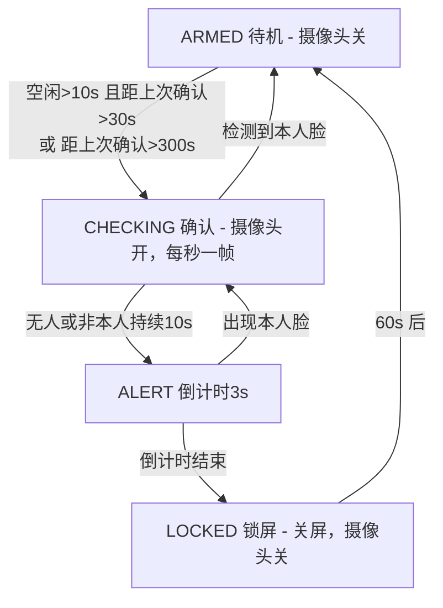

# PresenceLock

[](LICENSE)
[](https://www.python.org/)
[](https://www.apple.com/macos/)

[🇨🇳 中文](README.zh.md) | [🇬🇧 English](README.md)

> macOS 摄像头在场检测锁屏：确认电脑前的人是**你**，不是任何人。全部本地处理，不上传任何画面。

---

## 为什么做（动机）

经常离开电脑忘了锁屏，办公室、实验室这种共享空间里就是实打实的隐私风险。"人走自动锁"听起来是现成需求，但 macOS 上的现有方案全都让我失望：

- **App Store 里的接近锁**（整个品类都是蓝牙方案）：靠手机距离判断人在不在，反应慢、误判多、手机忘在桌上就完全失效。
- **macOS 上没有摄像头方案**（见下面的空白性）。

我要的工具回答的问题是：坐在键盘前的人**是不是我**？而不是"附近有没有手机"。这就是这个项目存在的原因。

## 空白性：macOS 上没人做这个

| 平台 | 摄像头人走锁屏方案 | 说明 |
|---|---|---|
| Windows | ✅ 微软 Dynamic Lock（蓝牙）+ 多个开源摄像头工具（SeatSentinel、windows_bey 等） | Dynamic Lock 是蓝牙不是摄像头；摄像头方案已有多个 |
| Linux | ✅ boltgolt/howdy（7.7k★）等 | howdy 本职是刷脸*解锁*，人走锁屏是用户自己拼的 |
| **macOS** | ❌ **空白**。App Store 全是蓝牙方案；GitHub 上摄像头在场检测锁屏项目为零 | |

为什么是空白？macOS 有三堵墙，这个项目逐一拆掉：

1. **TCC 权限**——命令行进程读摄像头会静默失败，必须用对方法申请权限（项目里附了 `grant_camera.swift`）。
2. **没有公开锁屏 API**——所有常规路子（osascript 按键、CGEvent 注入、CGSession）在现行 macOS 上都失败。本项目用 `pmset displaysleepnow`，零权限，哪都能跑。
3. **摄像头绿灯**——常开摄像头又耗电又吓人，所以本项目只在需要确认时才开摄像头。

## 和其他方案相比的优点

| | **PresenceLock**（macOS） | 蓝牙接近锁 | 其他平台摄像头工具 |
|---|---|---|---|
| 验证**你的身份**，不是"有个人就行" | ✅ | ❌ 只认手机 | 大多只认"有人" |
| 锁屏延迟 | 秒级 | 十秒级/不可靠 | 秒级 |
| 摄像头常开 | ❌ 按需开（空闲时每 30 秒约 2 秒，活跃时每 5 分钟一次） | — | 多数常开 |
| 零权限锁屏（不需要辅助功能授权） | ✅ `pmset displaysleepnow` | — | 视平台 |
| 全程本地处理（Vision 神经引擎，不上传） | ✅ | — | 视平台 |
| 防陌生人 | ✅ 键鼠活动不能解除警惕；每 5 分钟定期复查 | ❌ | 视平台 |

## 特性

- **身份识别，不是人脸检测**：注册一次你的脸，之后只有画面里出现你的脸才算"人在"。陌生人、室友、空椅子，全部触发锁屏。
- **防陌生人状态机**：打字、动鼠标永远不能解除警报，只有摄像头看到你的脸才行。定期复查（默认 5 分钟）兜底"你离开后别人坐下"的场景。
- **摄像头按需开关**：绿灯几乎全程是灭的。只有键鼠空闲超阈值才开摄像头确认，确认完就关。
- **锁屏前倒计时**：锁屏前 3 秒系统通知，看一眼摄像头即可取消（防止低头捡笔就被锁）。
- **零权限锁屏**：`pmset displaysleepnow` + 系统"屏幕关闭后要求密码"。不需要辅助功能授权、不需要注入按键、不碰私有 API。
- **双击启动**：`start-presence-lock.command` 后台运行（关终端窗口不影响），`stop-presence-lock.command` 停止。

## 安装

需要 macOS 14+ 和 Xcode Command Line Tools（只用于编译权限小工具）。

```bash
git clone https://github.com/zhonxia/presence-lock.git
cd presence-lock
python3 -m venv .venv
.venv/bin/pip install -r requirements.txt
```

## 快速开始

```bash
# 1. 申请摄像头权限（编译辅助工具，弹出系统窗口点允许）
swiftc -O grant_camera.swift -o grant_camera_bin && ./grant_camera_bin

# 2. 注册你的脸（s 拍摄，建议 3 张不同角度，q 保存）
./run.sh register.py

# 3. 先 dry-run 验证识别（--preview 显示摄像头画面）
./run.sh main.py --dry-run --preview

# 4. 正式运行
./run.sh main.py
```

务必确认系统已开启"屏幕关闭后要求密码"：
系统设置 > 锁定屏幕 > 屏幕关闭后要求密码 > 立即。

### 日常使用

双击 `start-presence-lock.command` 后台启动（程序在后台运行，关终端窗口不影响，日志写 presence-lock.log）。
双击 `stop-presence-lock.command` 停止。

## 架构

四态状态机。核心规则只有一条：**只有摄像头看到你的脸才能解除警报**，键鼠空闲时间只决定"什么时候看"。



人脸特征：Apple Vision `VNCreateFaceprintRequest`（128 维，神经引擎加速）。所有参数在 `config.json` 里可调（空闲/无人/倒计时阈值、比对距离、复查周期）。

## 文件结构

```
presence-lock/
├── main.py                    # 状态机 + 主循环
├── vision_face.py             # Vision 人脸检测 + 128 维特征
├── register.py                # 交互式人脸注册
├── idle.py                    # 键鼠空闲检测（ioreg HIDIdleTime）
├── locker.py                  # pmset displaysleepnow 锁屏
├── grant_camera.swift         # TCC 摄像头权限工具（swiftc 编译）
├── run.sh                     # venv 启动器（清理宿主 PYTHONPATH）
├── start-presence-lock.command  # 双击后台启动
├── stop-presence-lock.command   # 双击停止
└── config.json                # 全部可调参数
```

## 已知限制（诚实说明）

1. 摄像头绿灯是硬件行为，软件关不掉。本项目尽量只在确认阶段开摄像头，但无法关闭指示灯。
2. 低头、背对屏幕超过 absent_lock_sec（10 秒）会被锁。3 秒倒计时就是为这个准备的：瞄一眼摄像头即可取消。
3. 锁屏 = 关屏 + 系统密码，安全级别等同系统锁屏，不是自定义锁。
4. 防不住已经知道你密码的人。

## 未来计划

- **区分"没人"和"陌生人"**：分开计时——画面没人（可能低头或短暂离开）60 秒锁屏，检测到陌生人的脸 10 秒锁屏；近期出现过陌生人时，即使他走出画面也延续快速锁屏。
- **人体检测兜底**：人脸检测的同时并行跑 `VNDetectHumanRectanglesRequest`（一次调用完成），低头、背对屏幕不算"离开"。

## 给贡献者的踩坑记录

这个项目存在，正是因为常规路子在这台系统上全都不通。动锁屏/权限相关代码前先读：

- **osascript 注入按键失败**（error 1002）——TCC 查的是 osascript 自身，不是宿主应用。
- **CGEventPost 注入按键在 macOS 15 上静默无效**（无权限的 CLI 进程）。验证注入要用可见按键（Cmd+Space），别用 F17 这种看不见效果的。
- **CGSession -suspend 在 macOS 15 已被移除**。
- **`pmset displaysleepnow` 是零权限的正解**——配合"屏幕关闭后要求密码"。
- **OpenCV 请求摄像头权限后不等人点允许就失败**——先跑项目里的 Swift 权限工具。
- **pyobjc 没有绑定 `VNGenerateFaceEmbeddingsRequest`**（macOS 14 新 API）——用 `VNCreateFaceprintRequest` + `faceprint().descriptorData()`（128 个 float32）。
- **宿主环境会注入 PYTHONPATH**——一律用 `run.sh` 启动（会清掉），否则 numpy import 报错很诡异。

## 许可证

MIT — 见 [LICENSE](LICENSE)。
